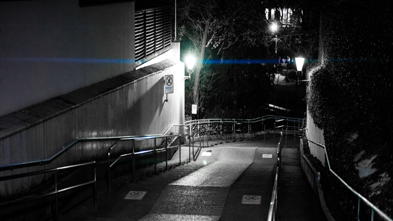

# desqueeze

desqueeze produce the de-squeezed(stretched) image file. desqueeze is written in Go, install is deadly simple - just grab the binary from [Releases page](https://github.com/etsxxx/desqueeze/releases) and drop it in your `$PATH`.

## I/O Example

input (before de-squeeze)

 

output (after de-squeeze)


# Installation

## from Releases

Go to the [Releases page](https://github.com/etsxxx/desqueeze/releases) and download the file. Unpack the archive file, and put the binary to `$PATH` or somewhere you want.

# Usage

## Basics

### Simply

Run the binary with image file path.

```
desqueeze [OPTIONS] imagefile
```

desqueeze produce the de-squeezed(stretched) image file. 
The filename is input filename with suffix '-desqueeze'. (ex: input.jpg -> input-desqueeze.jpg)

### Change multiplies

desqueeze default multiplies width by 1.33. If the squeeze factor of your lens is x2.00, run with `-m 2.00` option.

```
desqueeze -m 2.00 imagefile
```

### Overwrite mode
With batch or photo management software (ex: Adobe Lightroom Classic), `--overwrite` option is worth using. **This option overwrites input file.**

```
desqueeze --overwrite imagefile
```

## Options

You can see all `[OPTIONS]` with `--help` command.

### -h, --help

Display a help message.

### --version

Display the version.

### --out value, -o value

Specify the output file path. The default value is input file path with suffix '-desqueeze' (ex: input.jpg -> input-desqueeze.jpg)

### --multiply value, -m value

Multiplies the image width by the specified number. The default is `1.33`. If your anamorphic lens is x2.00, set `-m 2.00`.

### --quality value, -q value

Specify the output JPEG file quality. The default is `100`.

### --overwrite, -O

desqueeze does not create new file, overwrite input file. 

**Be careful not to run on the original file.**

# Hack and Develop

First, fork this repo, and get your clone locally.

1. Install [go](http://golang.org)
2. Install `make`
3. For cross build, install [goxc](https://github.com/laher/goxc)

To test, run

```
make test
```

To build, run

```
make build
```

This will create a `desqueeze` binary in `.bin/`.

To cross build, run

```
make cross
```

This will create the Linux/MacOS/Windows packages in the `./dist/snapshot/` directory.

**PRs are welcome!**

# TODO

- Test
- Supports more image formats, image color spaces.


# AUTHORS

* etsxxx

# NOTICES

- Current version only supports **JPEG** file format.
- Current version only supports **sRGB 8bits** color space.
